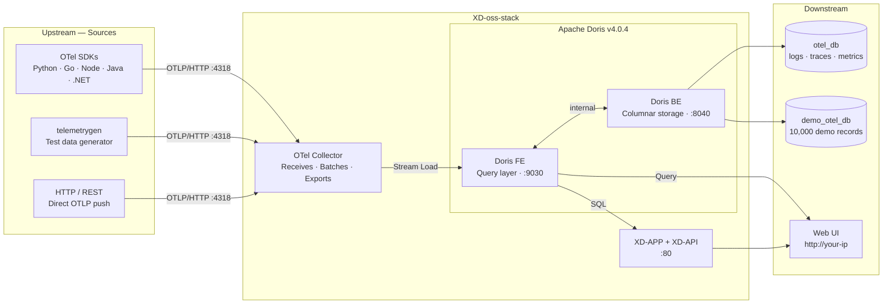

<div align="center">


<h1>XD-oss-stack</h1>

<p><strong>Self-hosted observability stack — ingest, store and explore your data at scale</strong></p>

<p>
  
  
  
  
  
  
  <a href="https://github.com/xplurdata/oss-stack/actions/workflows/security-scan.yml">
    
  </a>
</p>

<br/>

> **One command. Full observability stack. No cloud required.**

<br/>

</div>

---

## What is XD-oss-stack?

**XD-oss-stack** is a self-hosted, Docker-based observability platform built for teams who want **full control** over their telemetry data — no vendor lock-in, no per-seat pricing, no data leaving your infrastructure.

| | |
|---|---|
| **Ingest** | Receive logs from any service via OpenTelemetry (OTLP/HTTP) |
| **Store** | Apache Doris — a high-performance analytical database built for logs at scale |
| **Explore** | Web UI with full-text search, filtering, and real-time querying |
| **Deploy** | 4 Docker containers, one install command, runs anywhere |

---

## Architecture



### Databases

| Database | Tables | Purpose |
|----------|--------|---------|
| `otel_db` | `otel_logs`, `otel_traces`, `otel_metrics` | Live telemetry from OTel Collector |
| `demo_otel_db` | `otel_logs` | Pre-seeded demo data (10,000 records) |

---

## System Requirements

| Component | Minimum | Recommended |
|-----------|:-------:|:-----------:|
| CPU | 2 cores | 4+ cores |
| RAM | 4 GB | 8 GB |
| Disk | 20 GB | 100 GB |
| Docker | 20.10+ | latest |
| OS | Ubuntu 20.04+ / macOS 12+ | Ubuntu 22.04 |

> **Low RAM?** The installer automatically detects available memory and applies reduced JVM settings for machines with less than 8 GB RAM.

---

## Quick Install

### Prerequisites

| OS | Requirements |
|----|-------------|
| Linux | Nothing — Docker auto-installed if missing |
| macOS | Docker Desktop running |

### Install

```bash
bash -c "$(curl -fsSL https://raw.githubusercontent.com/xplurdata/oss-stack/main/install.sh)"
```

### What happens during install

```
  ╔═══════════════════════════════════════════════════════╗
  ║          XD-oss-stack Installer v1.0.0               ║
  ╚═══════════════════════════════════════════════════════╝

  ▶  Checking system requirements
  ✓  CPU: 8 cores          ✓  RAM: 16 GB
  ✓  Disk: 120 GB free     ✓  Ports: 80, 4318 available

  ▶  Pulling Docker images
  ✓  All images downloaded

  ▶  Starting containers
  ℹ  This may take up to 10 minutes on first run while Doris initializes.
  ✓  All containers started

  ▶  Waiting for services
  ✓  Doris Frontend         healthy (67s)
  ✓  Doris Backend          healthy (102s)
  ✓  Application            healthy (142s)
  ✓  Login endpoint         ready (198s)
  ✓  OTel Collector         running

  ╔═══════════════════════════════════════════════════════╗
  ║   ✓  Installation Complete!                          ║
  ║      Happy Xpluring your data!                       ║
  ╚═══════════════════════════════════════════════════════╝
```

---

## Access

After install (~3-5 minutes on first boot):

| Service | URL | Credentials |
|---------|-----|-------------|
| Web UI | `http://<your-ip>` | `admin` / `admin` |
| OTLP HTTP | `http://<your-ip>:4318` | — |

---

## Sending Logs

### Quick test with telemetrygen

```bash
docker run --rm \
  --network xd-oss-stack_otel-net \
  ghcr.io/open-telemetry/opentelemetry-collector-contrib/telemetrygen:latest \
  logs \
  --otlp-endpoint otel-collector:4318 \
  --otlp-http \
  --otlp-insecure \
  --duration 10s \
  --rate 100 \
  --service my-service
```

### Send logs from your application

<details>
<summary><b>Python</b></summary>

```bash
pip install opentelemetry-sdk opentelemetry-exporter-otlp-proto-http
```

```python
import logging
from opentelemetry._logs import set_logger_provider
from opentelemetry.sdk._logs import LoggerProvider, LoggingHandler
from opentelemetry.sdk._logs.export import BatchLogRecordProcessor
from opentelemetry.exporter.otlp.proto.http._log_exporter import OTLPLogExporter
from opentelemetry.sdk.resources import Resource

resource = Resource.create({"service.name": "my-service"})
provider = LoggerProvider(resource=resource)
provider.add_log_record_processor(
    BatchLogRecordProcessor(
        OTLPLogExporter(endpoint="http://<YOUR_HOST>:4318/v1/logs")
    )
)
set_logger_provider(provider)

logger = logging.getLogger("my-service")
logger.addHandler(LoggingHandler(logger_provider=provider))
logger.setLevel(logging.INFO)
logger.info("Hello from my-service!")
```
</details>

<details>
<summary><b>Node.js</b></summary>

```bash
npm install @opentelemetry/sdk-logs @opentelemetry/exporter-logs-otlp-http @opentelemetry/sdk-node
```

```javascript
const { LoggerProvider, BatchLogRecordProcessor } = require('@opentelemetry/sdk-logs');
const { OTLPLogExporter } = require('@opentelemetry/exporter-logs-otlp-http');

const provider = new LoggerProvider();
provider.addLogRecordProcessor(
  new BatchLogRecordProcessor(
    new OTLPLogExporter({ url: 'http://<YOUR_HOST>:4318/v1/logs' })
  )
);

const logger = provider.getLogger('my-service');
logger.emit({ severityText: 'INFO', body: 'Hello from my-service!' });
```
</details>

<details>
<summary><b>Java</b></summary>

```bash
# Download OpenTelemetry Java Agent
wget https://github.com/open-telemetry/opentelemetry-java-instrumentation/releases/latest/download/opentelemetry-javaagent.jar

# Run your app with auto-instrumentation
java \
  -javaagent:opentelemetry-javaagent.jar \
  -Dotel.service.name=my-service \
  -Dotel.logs.exporter=otlp \
  -Dotel.exporter.otlp.endpoint=http://<YOUR_HOST>:4318 \
  -jar app.jar
```

```java
// Or manual SDK
import io.opentelemetry.api.logs.Logger;
// point exporter to http://<YOUR_HOST>:4318/v1/logs
logger.logRecordBuilder()
      .setBody("Hello from my-service!")
      .setSeverity(Severity.INFO)
      .emit();
```
</details>

<details>
<summary><b>Go</b></summary>

```bash
go get go.opentelemetry.io/otel
go get go.opentelemetry.io/otel/exporters/otlp/otlplog/otlploghttp
```

```go
package main

import (
    "context"
    "go.opentelemetry.io/otel/exporters/otlp/otlplog/otlploghttp"
    "go.opentelemetry.io/otel/log/global"
    sdklog "go.opentelemetry.io/otel/sdk/log"
)

func main() {
    exporter, _ := otlploghttp.New(context.Background(),
        otlploghttp.WithEndpoint("<YOUR_HOST>:4318"),
        otlploghttp.WithInsecure(),
    )
    provider := sdklog.NewLoggerProvider(
        sdklog.WithProcessor(sdklog.NewBatchProcessor(exporter)),
    )
    global.SetLoggerProvider(provider)
}
```
</details>

<details>
<summary><b>.NET</b></summary>

```bash
dotnet add package OpenTelemetry.Exporter.OpenTelemetryProtocol
dotnet add package OpenTelemetry.Extensions.Hosting
```

```csharp
using OpenTelemetry.Logs;

builder.Logging.AddOpenTelemetry(options => {
    options.AddOtlpExporter(otlp => {
        otlp.Endpoint = new Uri("http://<YOUR_HOST>:4318/v1/logs");
    });
});

var logger = app.Services.GetRequiredService<ILogger<Program>>();
logger.LogInformation("Hello from my-service!");
```
</details>

<details>
<summary><b>Ruby</b></summary>

```bash
gem install opentelemetry-sdk opentelemetry-exporter-otlp
```

```ruby
require 'opentelemetry-sdk'
require 'opentelemetry-exporter-otlp'

OpenTelemetry::SDK.configure do |c|
  c.service_name = 'my-service'
  c.add_span_processor(
    OpenTelemetry::SDK::Trace::Export::BatchSpanProcessor.new(
      OpenTelemetry::Exporter::OTLP::Exporter.new(
        endpoint: 'http://<YOUR_HOST>:4318/v1/logs'
      )
    )
  )
end
```
</details>

<details>
<summary><b>PHP</b></summary>

```bash
composer require open-telemetry/sdk open-telemetry/exporter-otlp
```

```php
<?php
use OpenTelemetry\SDK\Logs\LoggerProvider;
use OpenTelemetry\Contrib\Otlp\OtlpHttpTransportFactory;
use OpenTelemetry\Contrib\Otlp\LogsExporter;

$transport = (new OtlpHttpTransportFactory())->create(
    'http://<YOUR_HOST>:4318/v1/logs', 'application/x-protobuf'
);
$exporter = new LogsExporter($transport);
$provider = LoggerProvider::builder()
    ->addLogRecordProcessor(new SimpleLogRecordProcessor($exporter))
    ->build();

$logger = $provider->getLogger('my-service');
$logger->logRecord()->setBody('Hello from my-service!')->emit();
```
</details>

<details>
<summary><b>Rust</b></summary>

```toml
# Cargo.toml
[dependencies]
opentelemetry = "0.22"
opentelemetry-otlp = { version = "0.15", features = ["logs"] }
opentelemetry_sdk = { version = "0.22", features = ["logs"] }
```

```rust
use opentelemetry_otlp::WithExportConfig;
use opentelemetry_sdk::logs::LoggerProvider;

let exporter = opentelemetry_otlp::new_exporter()
    .http()
    .with_endpoint("http://<YOUR_HOST>:4318/v1/logs");

let provider = LoggerProvider::builder()
    .with_batch_exporter(exporter.build_log_exporter().unwrap(),
        opentelemetry_sdk::runtime::Tokio)
    .build();
```
</details>

---

## Management

```bash
~/xd-oss-stack/manage.sh status       # container status
~/xd-oss-stack/manage.sh logs         # follow app logs
~/xd-oss-stack/manage.sh logs otel-collector
~/xd-oss-stack/manage.sh logs doris-fe
~/xd-oss-stack/manage.sh logs doris-be
~/xd-oss-stack/manage.sh update       # pull latest images
~/xd-oss-stack/manage.sh restart      # restart all containers
~/xd-oss-stack/manage.sh stop         # stop all containers (preserves data)
~/xd-oss-stack/manage.sh uninstall    # remove everything
```

---


## Demo Data

On first boot the stack seeds **10,000 realistic log records** across 5 microservices so you can explore immediately:

| Service | Records | Severity |
|---------|---------|---------|
| api-gateway | ~2,000 | 70% INFO · 15% WARN · 15% ERROR |
| auth-service | ~2,000 | 70% INFO · 15% WARN · 15% ERROR |
| payment-service | ~2,000 | 70% INFO · 15% WARN · 15% ERROR |
| notification-service | ~2,000 | 70% INFO · 15% WARN · 15% ERROR |
| inventory-service | ~2,000 | 70% INFO · 15% WARN · 15% ERROR |

---

## Troubleshooting

<details>
<summary><b>Install stopped midway — how to clean up and retry</b></summary>

If the installer stops after "Writing configuration" for any reason, clean up before retrying:

```bash
docker compose -f ~/xd-oss-stack/docker-compose.yml down -v 2>/dev/null || true
sudo rm -rf /var/lib/xd-oss-stack
docker network prune -f

# Then re-run the installer
bash -c "$(curl -fsSL https://raw.githubusercontent.com/xplurdata/oss-stack/main/install.sh)"
```
</details>

<details>
<summary><b>Stack not starting</b></summary>

```bash
docker logs otel-doris-fe
docker logs otel-doris-be
```
</details>

<details>
<summary><b>Doris FE fails with "insufficient memory"</b></summary>

Your machine has less than 8 GB RAM. The installer automatically applies reduced JVM settings. If it still fails:

```bash
free -h  # check available memory
~/xd-oss-stack/manage.sh stop
bash -c "$(curl -fsSL https://raw.githubusercontent.com/xplurdata/oss-stack/main/install.sh)"
```
</details>

<details>
<summary><b>No data in otel_db.otel_logs</b></summary>

```bash
docker logs otel-collector
```
</details>

<details>
<summary><b>App not ready after 5 minutes</b></summary>

```bash
docker logs -f otel-app
```
</details>

<details>
<summary><b>Port 80 or 4318 already in use</b></summary>

```bash
sudo lsof -i :80
sudo lsof -i :4318
```
</details>

<details>
<summary><b>macOS: process.lock AccessDeniedException</b></summary>

The installer uses `~/.xd-oss-stack/data` on macOS to avoid bind mount permission issues. If it still fails:

```bash
rm -rf ~/.xd-oss-stack
bash -c "$(curl -fsSL https://raw.githubusercontent.com/xplurdata/oss-stack/main/install.sh)"
```
</details>

<details>
<summary><b>Full reset (wipes all data)</b></summary>

```bash
~/xd-oss-stack/manage.sh uninstall
bash -c "$(curl -fsSL https://raw.githubusercontent.com/xplurdata/oss-stack/main/install.sh)"
```
</details>

---

## Community

| | |
|---|---|
| 💼 **LinkedIn** | [xplurdata](https://www.linkedin.com/company/xplurdata) |
| 💬 **Slack** | [Join our Slack](https://xplurdata.slack.com) |
| 🌐 **Website** | [xplurdata.com](https://www.xplurdata.com) |

---

## License

This project is licensed under the **[GNU Affero General Public License v3.0 (AGPL-3.0)](LICENSE)**.


---

<div align="center">

**Built by [Xplurdata](https://github.com/xplurdata) · Happy Xpluring your data!**

[Apache Doris](https://doris.apache.org/) &nbsp;·&nbsp; [OpenTelemetry](https://opentelemetry.io/) &nbsp;·&nbsp; [xplurdata.com](https://www.xplurdata.com)

<br/>

⭐ Star this repo if you find it useful!

</div>
